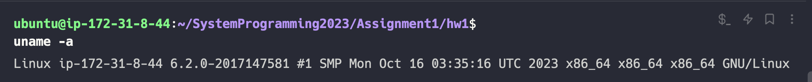

> 인공지능융합대학 컴퓨터과학과  
> 2017147581 서혁준

## 1. 과제 수행 환경

AWS EC2에서 `x86_64` 기반 우분투 인스턴스를 대여하여 과제를 수행하였다.
인스턴스의 유형을 유동적으로 변경할 수 있는 클라우드 환경의 특성을 활용하여, 커널 빌드 등 CPU-intensive한 작업 수행 시 `m5a.2xlarge`, 모듈 프로그래밍 등의 일반적인 작업 시에는 `m5a.large` 인스턴스를 활용하였다.

아래 작업환경은 `m5a.large` 인스턴스 사용 중에서의 스크린샷이다.

**Host OS**

- Ubuntu 22.04
- `uname -a`
  
  **Memory**
- `/proc/meminfo`
  ![[proc_meminfo.png]]
  **CPU**
- `lscpu`
  
- `/proc/cpuinfo`
  ![[proc_cpuinfo.png]]

<div style="page-break-after: always;"></div>

## 2. 구조 및 동작 과정

### 2.1 전체 프로젝트 구조


전체적인 과제 수행 코드의 구조는 위와 같다. 위 그림에서는 사용되는 자료구조 및 참조관계 표시하였다.
과제에서 수정 및 작성해야 하는 코드는 크게 3가지로 구분할 수 있다.

1. 커널 코드
   - `/include/linux/sched.h` : 스케쥴러 관련 데이터 구조 등이 정의된 헤더 파일
   - `/kernel/sched/core.c` : 스케쥴러 관련 메인 비즈니스 로직이 정의된 파일
2. 모듈 코드
   - `/module/hw1.c` : `/proc/hw1` 호출 시 스케쥴링 정보를 출력하는 파일

따라서 각 파일의 역할을 아래와 같이 정의하였다.

- `sched.h` : 과제에서 사용할 자료구조 정의
- `core.c` : 스케쥴링 정보를 저장하는 메인 로직 구현
- `hw1.c` : `core.c` 에서 저장한 스케쥴링 정보에 접근하여, 최근 20개의 스케쥴링 정보를 출력

<div style="page-break-after: always;"></div>

### 2.2 커널 코드

#### 2.2.1 `sched.h`


이번 과제를 위해 `sched.h` 에 새로 정의한 구조체는 다음과 같다.

1. `hw1_task_info`
   이 구조체는 task에 대한 정보를 저장하는 구조체이다. 따라서 과제 요구사항에 필요한 정보를 멤버변수로 갖는다.
   - `task_name` : 작업 커맨드 명
   - `sched_type` : task의 스케쥴러 종류
   - `prio` : 작업의 priority
   - `creat_time` : 작업 생성 시간
   - `pid` : 작업의 PID
2. `hw1_schedule_info`
   한번의 스케쥴링 과정에서 `prev` 태스크와 `next` 태스크에 대한 정보를 갖는 구조체이다. 멤버 변수는 다음과 같다.
   - `cpu` : CPU 번호
   - `prev` : 이전(현재) 태스크에 대한 정보.
   - `next` : 다음 태스크에 대한 정보

<div style="page-break-after: always;"></div>

#### 2.2.2 `core.c`


`core.c`에는 `sched.h`에서 정의한 자료구조를 이용하여 최근 스케쥴링 정보를 담는 `hw1_recent_schedules[20]` 배열 및 인덱스를 정의한다.
이후 `schedule()` 함수 호출 시 `prev` task의 상태 처리 및 `next` task가 결정된 시점에 `hw1_recent_schedules`의 `hw1_recent_schedules_index` 가 가리키는 구조체에 `prev`, `next` 태스크에 대한 정보를 복사한다.

또한 2.1에서 확인할 수 있듯이 `EXPORT_SYMBOL` 매크로를 이용하여 `hw1_recent_schedules_index`와 `hw1_recent_schedules` 자료구조를 외부 모듈에 노출해주고 있다.

<div style="page-break-after: always;"></div>

### 2.3 모듈 코드

#### 2.3.1 `hw1.c`

![[hw1_module.png]]
`hw1.c` 모듈에서는 `core.c`에서 전역변수로 제공하는 `hw1_recent_schedules_index` 및 `hw1_recent_schedules` 자료구조를 `extern` 키워드를 이용해 받아온다.
이후 `/proc/hw1` 호출 시 `sched_info_proc_show()` 함수가 실행되면서 과거 실행 정보부터 최신 실행 정보까지 20번의 스케쥴링 정보를 출력한다.

<div style="page-break-after: always;"></div>

## 3. 결과 검증

### 3.1 프로그램 실행 결과

### 3.1.1 모듈 등록 및 제거

모듈 빌드 및 등록, 제거가 정상적으로 작동하는 것을 확인할 수 있다.

![[module_load.png]]
![[module_remove.png]]

<div style="page-break-after: always;"></div>

#### 3.1.2 `cat /proc/hw1`

정상적으로 스케쥴링 정보를 출력하고 있다.
![[result_1.png]]
![[result_2.png]]
![[result_3.png]]
![[result_4.png]]
![[result_5.png]]

<div style="page-break-after: always;"></div>

### 3.2 결과 검증 방법

3.1.2에서의 실행 결과를 CPU별로 모아서 확인하면 아래와 같다.
각 CPU별로 연속적으로 스케쥴되는 프로세스들의 PID를 확인해 보면 연속적으로 `next`였던 프로세스가 `prev`로 이어지는 것을 볼 수 있다.
이를 통해 프로그램이 정상적으로 작동한다는 것을 알 수 있다.

- CPU #0

  ```text
  schedule() trace #1 - CPU #0
  Command: swapper/0
  PID: 0
  Priority: 120
  Start time (ms): 0
  Scheduler: IDLE
  ->
  Command: bash
  PID: 6734
  Priority: 120
  Start time (ms): 844424
  Scheduler: CFS
  --------------------------------------------------
  schedule() trace #2 - CPU #0
  Command: bash
  PID: 6734
  Priority: 120
  Start time (ms): 844424
  Scheduler: CFS
  ->
  Command: bash
  PID: 819
  Priority: 120
  Start time (ms): 49589
  Scheduler: CFS
  --------------------------------------------------
  schedule() trace #3 - CPU #0
  Command: bash
  PID: 819
  Priority: 120
  Start time (ms): 49589
  Scheduler: CFS
  ->
  Command: kworker/u4:1
  PID: 30
  Priority: 120
  Start time (ms): 529
  Scheduler: CFS
  --------------------------------------------------
  schedule() trace #4 - CPU #0
  Command: kworker/u4:1
  PID: 30
  Priority: 120
  Start time (ms): 529
  Scheduler: CFS
  ->
  Command: sshd
  PID: 818
  Priority: 120
  Start time (ms): 49506
  Scheduler: CFS
  --------------------------------------------------
  schedule() trace #5 - CPU #0
  Command: sshd
  PID: 818
  Priority: 120
  Start time (ms): 49506
  Scheduler: CFS
  ->
  Command: bash
  PID: 819
  Priority: 120
  Start time (ms): 49589
  Scheduler: CFS
  --------------------------------------------------
  schedule() trace #7 - CPU #0
  Command: bash
  PID: 819
  Priority: 120
  Start time (ms): 49589
  Scheduler: CFS
  ->
  Command: swapper/0
  PID: 0
  Priority: 120
  Start time (ms): 0
  Scheduler: IDLE
  --------------------------------------------------
  schedule() trace #8 - CPU #0
  Command: swapper/0
  PID: 0
  Priority: 120
  Start time (ms): 0
  Scheduler: IDLE
  ->
  Command: bash
  PID: 6739
  Priority: 120
  Start time (ms): 844427
  Scheduler: CFS
  --------------------------------------------------
  schedule() trace #10 - CPU #0
  Command: comm
  PID: 6739
  Priority: 120
  Start time (ms): 844427
  Scheduler: CFS
  ->
  Command: swapper/0
  PID: 0
  Priority: 120
  Start time (ms): 0
  Scheduler: IDLE
  --------------------------------------------------
  schedule() trace #15 - CPU #0
  Command: swapper/0
  PID: 0
  Priority: 120
  Start time (ms): 0
  Scheduler: IDLE
  ->
  Command: kworker/u4:1
  PID: 30
  Priority: 120
  Start time (ms): 529
  Scheduler: CFS
  --------------------------------------------------
  schedule() trace #16 - CPU #0
  Command: kworker/u4:1
  PID: 30
  Priority: 120
  Start time (ms): 529
  Scheduler: CFS
  ->
  Command: sshd
  PID: 818
  Priority: 120
  Start time (ms): 49506
  Scheduler: CFS
  --------------------------------------------------
  schedule() trace #17 - CPU #0
  Command: sshd
  PID: 818
  Priority: 120
  Start time (ms): 49506
  Scheduler: CFS
  ->
  Command: swapper/0
  PID: 0
  Priority: 120
  Start time (ms): 0
  Scheduler: IDLE
  --------------------------------------------------
  schedule() trace #18 - CPU #0
  Command: swapper/0
  PID: 0
  Priority: 120
  Start time (ms): 0
  Scheduler: IDLE
  ->
  Command: bash
  PID: 6740
  Priority: 120
  Start time (ms): 844429
  Scheduler: CFS
  --------------------------------------------------
  ```

<div style="page-break-after: always;"></div>

- CPU #1

```text
--------------------------------------------------
schedule() trace #0 - CPU #1
Command: tr
PID: 6737
Priority: 120
Start time (ms): 844424
Scheduler: CFS
->
Command: swapper/1
PID: 0
Priority: 120
Start time (ms): 349
Scheduler: IDLE
--------------------------------------------------
schedule() trace #6 - CPU #1
Command: swapper/1
PID: 0
Priority: 120
Start time (ms): 349
Scheduler: IDLE
->
Command: bash
PID: 6738
Priority: 120
Start time (ms): 844427
Scheduler: CFS
--------------------------------------------------
schedule() trace #9 - CPU #1
Command: bash
PID: 6738
Priority: 120
Start time (ms): 844427
Scheduler: CFS
->
Command: swapper/1
PID: 0
Priority: 120
Start time (ms): 349
Scheduler: IDLE
--------------------------------------------------
schedule() trace #11 - CPU #1
Command: swapper/1
PID: 0
Priority: 120
Start time (ms): 349
Scheduler: IDLE
->
Command: bash
PID: 6738
Priority: 120
Start time (ms): 844427
Scheduler: CFS
--------------------------------------------------
schedule() trace #12 - CPU #1
Command: bash
PID: 6738
Priority: 120
Start time (ms): 844427
Scheduler: CFS
->
Command: bash
PID: 819
Priority: 120
Start time (ms): 49589
Scheduler: CFS
--------------------------------------------------
schedule() trace #13 - CPU #1
Command: bash
PID: 819
Priority: 120
Start time (ms): 49589
Scheduler: CFS
->
Command: bash
PID: 6738
Priority: 120
Start time (ms): 844427
Scheduler: CFS
--------------------------------------------------
schedule() trace #14 - CPU #1
Command: bash
PID: 6738
Priority: 120
Start time (ms): 844427
Scheduler: CFS
->
Command: bash
PID: 819
Priority: 120
Start time (ms): 49589
Scheduler: CFS
--------------------------------------------------
schedule() trace #19 - CPU #1
Command: bash
PID: 819
Priority: 120
Start time (ms): 49589
Scheduler: CFS
->
Command: swapper/1
PID: 0
Priority: 120
Start time (ms): 349
Scheduler: IDLE
--------------------------------------------------
```

<div style="page-break-after: always;"></div>

## 3. 3 문제점 및 애로사항

### 3.3.1 `dpkg-source` 빌드 에러

`make -j$(nproc) deb-pkg`를 통해 커널을 빌드하는 과정에서 `dpkg-source` 관련 빌드 에러가 자주 발생하였다. 이는 `dpkg-source`가 이전 빌드에서 사용된 부산물을 재사용하는 과정에서 발생하는 것으로 보였다.
해당 에러는 리눅스 소스 코드 폴더 내부에 `make clean`으로 지워지지 않는 빌드 부산물 파일들 (ex. `/debian`, `vmlinux_gdb.py` ) 등의 파일들을 전부 지우고 빌드하는 방식으로 해결하였다.

- Reference
  - [stackoverflow](https://stackoverflow.com/questions/56149191/linux-latest-stable-compilation-cannot-represent-change-to-vmlinux-gdb-py)

### 3.3.2 EC2 GRUB

AWS EC2는 HVM 방식의 가상화를 제공하며, 사용자 제공 커널을 인스턴스에서 사용할 수 있다.
하지만 기존 로컬 가상머신에서 `sudo dpkg -i`를 한 이후 `sudo reboot` 를 실행하면 자동으로 변경된 커널로 부팅되는 것과 달리 `grub` 을 통한 추가적인 커널 세팅을 필요로 했다.

방법으로는 우선 `/boot/grub/grub.cfg` 파일에서 원하는 커널이 `grub` 세팅에서 어느 위치에 해당하는지 확인한다.

- `/boot/grub/grub.cfg | grep menuentry

```c
menuentry 'Ubuntu' --class ubuntu --class gnu-linux --class gnu --class os

submenu 'Advanced options for Ubuntu' {
        menuentry 'Ubuntu, with Linux 6.2.0-1013-aws' --class ubuntu --class gnu-linux --class gnu --class os
        menuentry 'Ubuntu, with Linux 6.2.0-1013-aws (recovery mode)' --class ubuntu --class gnu-linux --class gnu --class  {
        menuentry 'Ubuntu, with Linux 6.2.0-2017147581' --class ubuntu --class gnu-linux --class gnu --class os $menuentry_id_option 'gnulinux-6.2.0-2017147581-advanced-4513eb34-58e6-408e-8ed7-3d487fe6b35b' {
        menuentry 'Ubuntu, with Linux 6.2.0-2017147581 (recovery mode)' --class ubuntu --class gnu-linux --class gnu --class os $menuentry_id_option 'gnulinux-6.2.0-2017147581-recovery-4513eb34-58e6-408e-8ed7-3d487fe6b35b' {
        menuentry 'Ubuntu, with Linux 5.19.0-1025-aws' --class ubuntu --class gnu-linux --class gnu --class os $menuentry_id_option 'gnulinux-5.19.0-1025-aws-advanced-4513eb34-58e6-408e-8ed7-3d487fe6b35b' {
        menuentry 'Ubuntu, with Linux 5.19.0-1025-aws (recovery mode)' --class ubuntu --class gnu-linux --class gnu --class os $menuentry_id_option 'gnulinux-5.19.0-1025-aws-recovery-4513eb34-58e6-408e-8ed7-3d487fe6b35b' {
```

확인해 보면 우리가 원하는 커널인 `Ubuntu, with Linux 6.2.0-2017147581` 가 서브메뉴에 들어가있다는 것을 확인할 수 있다.

따라서 전체 옵션 중 submenu를 가리키는 1번에서 우리의 커널의 이름을 GRUB에 지정해줘야 한다. (0번은 `'Ubuntu'`)

- `/etc/default/grub`

```
GRUB_DEFAULT="1>Ubuntu, with Linux 6.2.0-2017147581"
```

위와 같이 설정한 이후 `sudo update-grub` 커맨드를 이용하여 변경사항을 저장해 주고 재부팅하면 커널이 정상적으로 적용되는 것을 확인할 수 있다.

- Reference
  - [Grub2/setup](https://help.ubuntu.com/community/Grub2/Setup#Configuring_GRUB_2)
