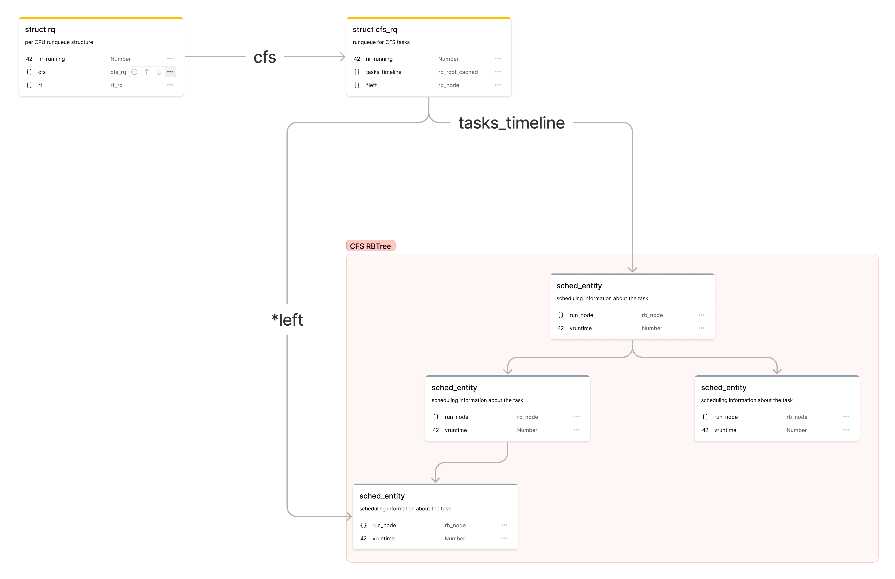
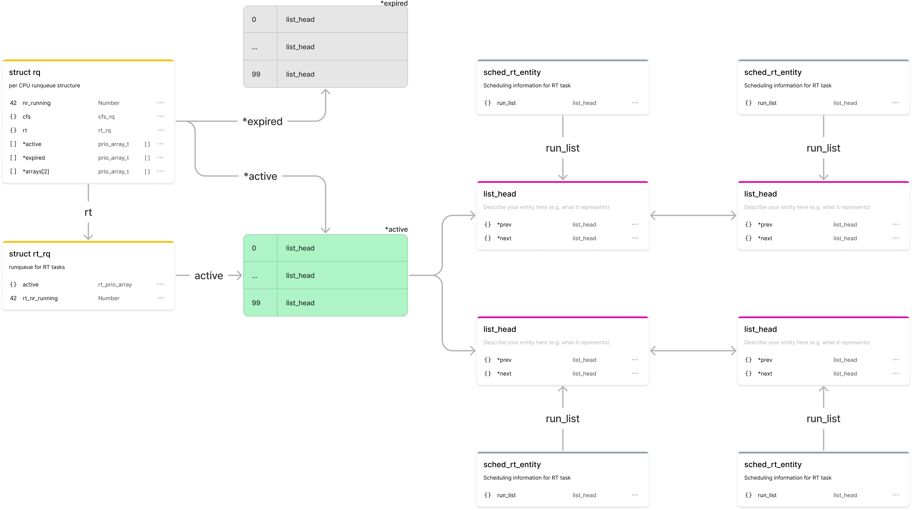
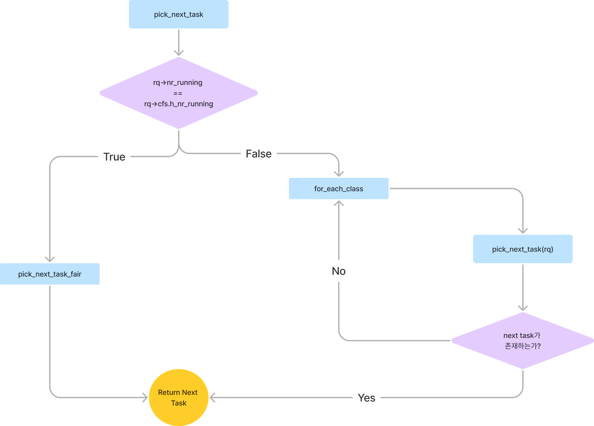
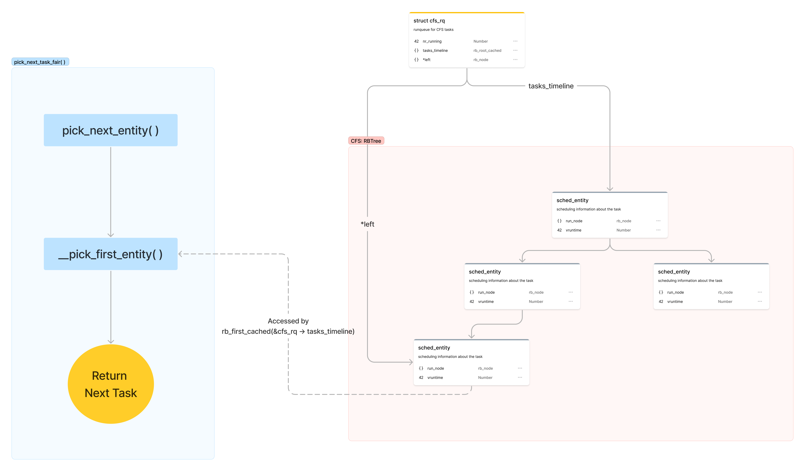
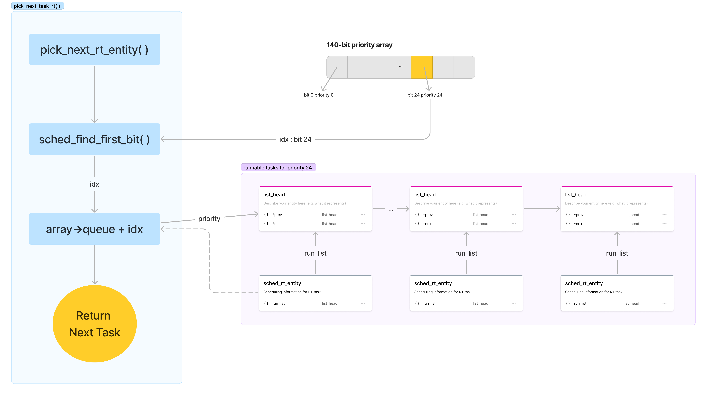

> 인공지능융합대학 컴퓨터과학과  
> 2017147581 서혁준

## 1. 스케쥴링 관련 자료구조 분석

### 1. 1 `rq`

`rq` 는 리눅스 스케쥴러에서 사용하는 runqueue의 역할을 하는 구조체로, 리눅스 `O(1)` 스케쥴러에서 가장 핵심적인 역할을 하는 자료구조이다.

리눅스는 SMP 시스템을 지원하기 위해서 각 CPU마다 `rq` 구조체를 가지고 있다.

```c
struct rq {
  spinlock_t lock;
  unsigned long nr_running;
  ...
  task_t *curr, *idle;
  ...
  prio_array_t *active;
  prio_array_t *expired;
  prio_array_t *arrays[2];
  int best_expired_prio;
}
```

- `lock`: `rq` 구조체에 대한 동기화를 위한 스핀락이다. 각 태스크들은 runqueue 상에서 자신의 상태를 업데이트 하기 위해서 `rq` 구조체에 대한 스핀락을 획득해야 한다.

```c
rq = task_rq_lock(task, &flags);
/* manipulate the task's runqueue, rq */
task_rq_unlock(rq, &flags);
```

- `nr_running`: 현재 **runqueue**에서 실행 가능한 상태의 태스크의 개수를 나타내는 변수이다.
- `curr` : 현재 CPU에서 실행중인 프로세스에 대한 Process Descriptor를 가리키는 포인터이다.
- `idle` : 현재 CPU의 swapper 프로세스를 가리키는 포인터이다.

> **swapper 프로세스**  
> swapper 프로세스는 _idle_ task로, 메모리에서 sleeping 상태인 task를 물리 디스크에 swap하는 역할을 한다.

- `arrays` : O(1) 스케쥴링을 위해서 유지하고 있는 두개의 priority queue를 가리키는 포인터 배열이다.
- `active` : O(1) 스케쥴링을 위해서 유지하고 있는 두개의 priority queue 중 현재 active한 priority queue를 가리키는 포인터이다.
- `expired` : O(1) 스케쥴링을 위해서 유지하고 있는 두개의 priority queue 중 현재 expired한 priority queue를 가리키는 포인터이다.

<div style="page-break-after: always;"></div>

### 1.2 `task_struct`

`task_struct`는 프로세스의 상태 및 관련 정보를 담고 있다.

`task_struct`의 멤버 변수 중 스케쥴링과 관련된 변수들을 표시하면 다음과 같다.

```c
struct task_struct {
  unsigned long thread_info
  ...
	int				on_rq;

  int				prio;
  int				static_prio;
  int				normal_prio;
  unsigned int			rt_priority;
  ...
  struct sched_entity		se;
  struct sched_rt_entity		rt;
  struct sched_dl_entity		dl;
  const struct sched_class	*sched_class;
  ...
  unsigned long policy;
};
```

- `thread_info->flag` : `TIF_NEED_RESCHED` flag를 저장하고 있다.
- `on_rq`: 프로세스가 스케쥴러의 실행 대기 큐에 있는지 여부를 나타내는 변수

#### 1.2.1 Priority 관련 변수

- `prio`: 프로세스의 우선순위를 나타내는 변수로, task가 Realtime Scheduling Task일 경우 `rt_priority`에 따라 0~99의 값을 가지며, normal 프로세스일 경우 `normal_prio`에 따라 100~139의 값을 가진다.
- `static_prio`: Normal Process (non-RT)의 정적 우선순위를 나타내는 변수로, bonus / penalty 등이 적용되지 않은 상태의 우선순위를 나타낸다.
- `normal_prio`: Normal Process (non-RT)의 동적 우선순위를 나타내는 변수로, task의 interactivity에 따른 bonus 혹은 penalty 등이 적용된 상태의 우선순위를 나타낸다.
- `rt_priority`: Real-Time Task (priority 0~99) 의 우선순위를 나타내는 변수이다.

#### 1.2.2 스케쥴러 관련 변수

- `se`, `rt`, `dl` : 각각 CFS, RT, DL 스케쥴러에서 사용하는 스케쥴링 정보를 저장하는 `sched_entity` 구조체이다.
- `sched_class`: 해당 Task가 속해있는 스케쥴러 타입을 나타내는 구조체로, `CFS`, `RT`, `IDLE`, `DL` 등의 스케쥴러 타입을 나타낼 수 있다.
- `policy` : 현재 스케쥴러의 스케쥴링 클래스를 나타낸다 (`SCHED_NORMAL`, `SCHED_RR`, `SCHED_FIFO`)

<div style="page-break-after: always;"></div>

### 1.3 `sched_entity`

`sched_entity`는 CFS 스케쥴러에서 사용하는 스케쥴링 정보를 저장하는 구조체이다.

```c
struct sched_entity {
  struct load_weight		load;		/* for load-balancing */
  struct rb_node			run_node;
  struct list_head		group_node;
  unsigned int			on_rq;

  u64				exec_start;
  u64				sum_exec_runtime;
  u64				vruntime;
  u64				prev_sum_exec_runtime;

  u64				nr_migrations;

  struct sched_statistics		statistics;
  ...
}
```

- `load`: CPU간 Load Balancing을 위해 사용되는 정보로, 해당 Task의 CPU 사용량을 나타낸다.
- `run_node`: CFS에서 다음으로 스케쥴할 태스크를 결정하는데 사용되는 레드-블랙 트리의 노드를 나타내는 변수.
- `on_rq`: 현재 Task가 CFS 스케쥴러의 실행 대기 큐에 있는지 여부를 나타내는 변수이다.
- `exec_start`: 현재 Task가 CPU에서 실행되기 시작한 시간을 나타내는 변수이다.
- `sum_exec_runtime`: 현재 Task가 CPU에서 실행된 시간의 합을 나타내는 변수이다.
- `vruntime`: 다음으로 스케쥴링될 태스크를 결정할 때 사용되는 Virtual Runtime 정보가 저장되는 변수로, CFS 스케쥴러에서는 `vruntime`이 가장 작은 Task가 가장 먼저 CPU를 할당받는다.

참고로, `sched_rt_entity`의 경우 RT 스케쥴러에서 사용하는 스케쥴링 정보를 저장하는 구조체이다.
RT 스케쥴링은 preemptive scheduling을 사용하기 때문에, `sched_entity`와는 다르게 `vruntime`이나 `run_node`가 없다.

```c
struct sched_rt_entity {
	struct list_head		run_list;
	unsigned long			timeout;
	unsigned long			watchdog_stamp;
	unsigned int			time_slice;
	unsigned short			on_rq;
	unsigned short			on_list;

	struct sched_rt_entity		*back;
#ifdef CONFIG_RT_GROUP_SCHED
	struct sched_rt_entity		*parent;
	/* rq on which this entity is (to be) queued: */
	struct rt_rq			*rt_rq;
	/* rq "owned" by this entity/group: */
	struct rt_rq			*my_q;
#endif
} __randomize_layout;
```

<div style="page-break-after: always;"></div>

### 1.4 `rq` 및 `sched_entity` 자료구조 간 연결 관계

#### CFS runqueue



`struct rq`는 Per-CPU 자료구조로서, `cfs_rq`와 `rt_rq`를 멤버 변수로 가지고 있다.
`cfs_rq`는 내부에 `tasks_timeline` 을 이용해서 CFS 스케쥴링에 사용하는 Red-Black Tree의 루트 노드를 가지고 있다.
또한 `*left` 포인터를 활용하여 다음으로 스케쥴할 task에 `O(1)`에 접근할 수 있도록 한다.

<div style="page-break-after: always;"></div>

#### RT Runqueue


`rt_rq`는 `cfs_rq`와 다르게 priority array를 이용한 스케쥴링을 진행한다.
이를 위해서 `rq` 자료구조 내부에 있는 `prio_array` 중 현재 active한 상태의 array인 `active` 를 멤버 변수로 갖는다.
`active` array는 priority 0~99 에 해당하는 프로세스들이 double linked list 형태로 저장되어 있다.
각 linked list의 노드는 `list_head` 자료구조로, `sched_rt_entity`가 `run_list` 멤버 변수를 통해 가지고 있다.

<div style="page-break-after: always;"></div>

## 2. `schedule()` 함수 동작 과정 분석

`schedule()` 함수는 _"runqueue list에서 다음으로 실행할 task를 찾고 CPU를 할당하는"_ 역할을 한다.

```c
	cpu = smp_processor_id();
	rq = cpu_rq(cpu);
	prev = rq->curr;
```

우선 현재 할당된 cpu 번호를 `smp_processor_id()` 함수를 이용해 받아오고, `cpu_rq()`를 통해 현재 CPU의 runqueue 정보를 받아온다.
그리고 해당 runqueue에서 현재 실행중인 프로세스의 정보를 `prev`에 저장한다.

다음으로 `prev` 의 상태에 따라서 해당 태스크를 runqueue에 유지할지, `deactivate`시킬지 결정하고 관련 동작을 처리한다.

```c
	next = pick_next_task(rq, prev, &rf);
	clear_tsk_need_resched(prev);
	clear_preempt_need_resched();
```

`prev` task의 상태에 대한 처리가 완료된 이후에는 `pick_next_task()` 함수를 통해 다음으로 실행할 태스크를 결정한다.
해당 함수의 내부적인 동작은 다음 섹션에서 설명한다.
그 이후 실질적인 프로세스 스위치가 이어나기 전에 `prev`의 `TIF_NEED_RESCHED` 플래그를 해제해준 뒤, 프로세스 스위치를 진행한다.

<div style="page-break-after: always;"></div>

### 2.1 `__pick_next_task()`



`pick_next_task()` 함수 내부적으로는 `__pick_next_task()` 함수를 호출하여 `next` 프로세스를 결정하는데 해당 함수의 코드는 아래와 같다.

```c
static inline struct task_struct *
__pick_next_task(struct rq *rq, struct task_struct *prev, struct rq_flags *rf)
{
	const struct sched_class *class;
	struct task_struct *p;
	if (likely(!sched_class_above(prev->sched_class, &fair_sched_class) &&
		   rq->nr_running == rq->cfs.h_nr_running)) {
		p = pick_next_task_fair(rq, prev, rf);
    ...
		return p;
	}
  ...
	for_each_class(class) {
		p = class->pick_next_task(rq);
		if (p)
			return p;
	}
  ...
}
```

다음으로 실행할 task를 선택하는 과정에서 커널은 다음 태스크가 RT 태스크인지, CFS 태스크인지를 먼저 판단한다.
이 과정에서 runqueue의 runnable한 태스크의 개수와 runqueue에서 CFS 스케쥴러에 해당하는 runnable 태스크의 개수를 비교한다.

만약 두 개수가 같다면, 현재 runqueue에 있는 모든 태스크가 CFS 스케쥴링에 해당한다는 뜻이므로, `pick_next_task_fair()` 함수를 호출하여 CFS 스케쥴러에서 다음으로 실행할 태스크를 선택한다.
그렇지 않을 경우 RT 태스크가 존재하는 것이므로 스케쥴러의 다른 클래스(RT, DL, ..) 에 대해서 `pick_next_task()` 함수를 호출하여 다음으로 실행할 태스크를 선택한다.

<div style="page-break-after: always;"></div>

### 2.2 `pick_next_task_fair()`


CFS 스케쥴러가 다음 task를 선택하는 방식 및 과정에서 참조하는 자료구조는 위 그림과 같다.

```c
pick_next_task_fair(struct rq *rq, struct task_struct *prev, struct rq_flags *rf)
{
	struct cfs_rq *cfs_rq = &rq->cfs;
	struct sched_entity *se;
	struct task_struct *p;

  ...
	do {
		se = pick_next_entity(cfs_rq, NULL);
		set_next_entity(cfs_rq, se);
		cfs_rq = group_cfs_rq(se);
	} while (cfs_rq);

	p = task_of(se);
  ...
}
```

`pick_next_task_fair()` 의 구현을 확인해 보면, `pick_next_entity()`를 호출하여 다음으로 실행할 task에 대한 `sched_entity`를 선택하고 있는 것을 확인할 수 있다.

이후 `task_of()` 매크로를 이용하여 `sched_entity`에 해당하는 `task_struct`를 찾아서 반환한다.

그렇다면 `pick_next_entity()`는 어떻게 동작하는가?

```c
static struct sched_entity *
pick_next_entity(struct cfs_rq *cfs_rq, struct sched_entity *curr)
{
	struct sched_entity *left = __pick_first_entity(cfs_rq);
	struct sched_entity *se;

	/*
	 * If curr is set we have to see if its left of the leftmost entity
	 * still in the tree, provided there was anything in the tree at all.
	 */
	if (!left || (curr && entity_before(curr, left)))
		left = curr;

	se = left; /* ideally we run the leftmost entity */
	...
}
```

`__pick_first_entity()`함수를 이용하여 현재 tree의 leftmost node를 찾아서 `*left`에 저장하고,
이후 여러 조건을 만족하는 경우 leftmost entity인 `*left`를 `se`에 저장하는 것을 확인할 수 있다.

```c
struct sched_entity *__pick_first_entity(struct cfs_rq *cfs_rq)
{
	struct rb_node *left = rb_first_cached(&cfs_rq->tasks_timeline);

	if (!left)
		return NULL;

	return __node_2_se(left);
}

/* CFS-related fields in a runqueue */
struct cfs_rq {
	struct load_weight	load;
  ...
	struct rb_root_cached	tasks_timeline;

	struct sched_entity	*curr;
	struct sched_entity	*next;
  ...
}
```

그리고 `__pick_first_entity()` 함수는 `cfs_rq`의 `tasks_timeline`에 저장된 `rb_node` 중 가장 왼쪽에 있는 노드를 찾아서 반환하는 함수이다.
이 때, `cfs_rq`의 멤버 변수인 `tasks_timeline`은 `rb_root_cached` 구조체로서, Red-Black Tree를 가리킨다.  
이를 통해 CFS 스케쥴러에서 RB-Tree 자료구조를 활용하여 다음으로 실행할 태스크를 선택하는 것을 확인할 수 있다.

<div style="page-break-after: always;"></div>

### 2.3 `pick_next_task_rt()`


RT 스케쥴러에 해당하는 task에 대해서 `schedule()` 함수가 다음 task를 결정하는 방식 및 참조하는 자료구조는 위와 같다.

`pick_next_task()`를 확인해 보면 각 `sched_class` 별로 `pick_next_task`를 검색하고 있으므로, `SCHED_RT`에 해당하는 클래스의 정의를 확인해 보자.

```c
DEFINE_SCHED_CLASS(rt) = {
	...

	.pick_next_task		= pick_next_task_rt,

	...
}

static struct task_struct *_pick_next_task_rt(struct rq *rq)
{
	struct sched_rt_entity *rt_se;
	struct rt_rq *rt_rq  = &rq->rt;

	do {
		rt_se = pick_next_rt_entity(rt_rq);
		BUG_ON(!rt_se);
		rt_rq = group_rt_rq(rt_se);
	} while (rt_rq);

	return rt_task_of(rt_se);
}
```

`rt` class 의 정의에서 `pick_next_task` 함수는 `pick_next_task_rt` 함수를 가리키고 있다.

그리고 `pick_next_task_rt`를 타고 들어가면 `__pick_next_task_rt()`에서 `pick_next_rt_entity()`를 사용한다는 것을 확인 할 수 있다.

```c
static struct sched_rt_entity *pick_next_rt_entity(struct rt_rq *rt_rq)
{
	struct rt_prio_array *array = &rt_rq->active;
	struct sched_rt_entity *next = NULL;
	struct list_head *queue;
	int idx;

	idx = sched_find_first_bit(array->bitmap);
	BUG_ON(idx >= MAX_RT_PRIO);

	queue = array->queue + idx;
	next = list_entry(queue->next, struct sched_rt_entity, run_list);

	return next;
}
```

여기에서 `array` 변수를 확인해 보면 `rt_rq->active`, 즉 현재 active한 priority queue를 가리키고 있음을 확인할 수 있다.

그리고 `sched_find_first_bit()` 함수를 통해 `array->bitmap`에서 가장 먼저 나오는 비트를 찾아서 `idx`에 저장한다. 이는 priority queue에서 태스크가 존재하는 가장 높은 우선순위를 나타낸다.

그 후 해당 `queue`에 접근하여 다음으로 실행될 태스크를 `next`에 저장하고, `next`를 반환한다.

이러한 과정은 RT 스케쥴러는 CFS와 다르게 RB-Tree를 사용하지 않고 priority queue만을 활용한 스케쥴링을 진행한다는 것을 보여준다.

## Reference

- [The Linux Scheduling Algorithm](http://books.gigatux.nl/mirror/kerneldevelopment/0672327201/ch04lev1sec2.html)
- [Understanding the linux kernel, Oreilly](https://www.oreilly.com/library/view/understanding-the-linux/0596005652/)
- [Linux Scheduler CFS and Red-Black Tree, Oakbytes](https://oakbytes.wordpress.com/2012/06/08/linux-scheduler-cfs-and-red-black-tree/)
- [Linux Kernel Source Code](https://elixir.bootlin.com/linux/v6.2/source)
